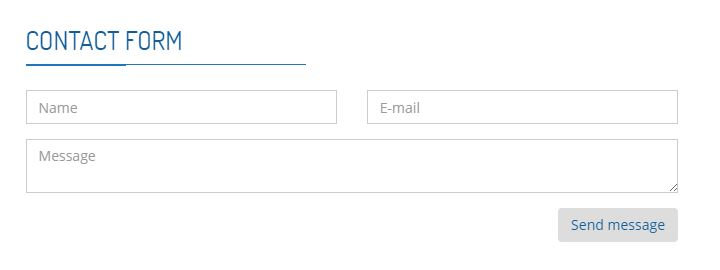

## Mailer

*NOTE: This requires composer and Sendgrid to be installed.*

#### Instructions

First, you will have to create a sendgrid account. [Link.](https://sendgrid.com/)

Add the javascript and php files to your project. 

Insert the html code snippet for the form to your desired location. 

Generate an API key using sendgrid (give maximum access to everything), and inside the php file, replace the $API KEY with your key. 

`$sendgrid = new SendGrid('API KEY');`

Inside the javascript, remember to replace the email and name with your own. 

The form should be set up correctly now.

#### Running the mailer

When the "Send" button is hit, if the message was sent successfully the contents of the message will clear and a success message will appear.

Inside the js file, the user is notified that the form submit is successful via changing the classname of the submit button from primary to success, or danger if error. 
You probably do not have those css classes, so either make your own or substitute with some css class you have.

